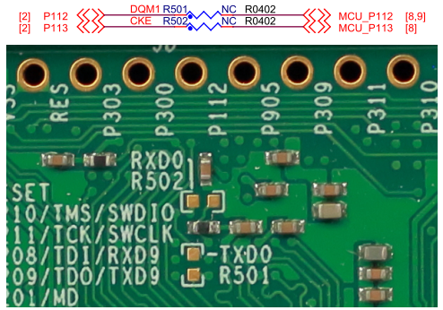
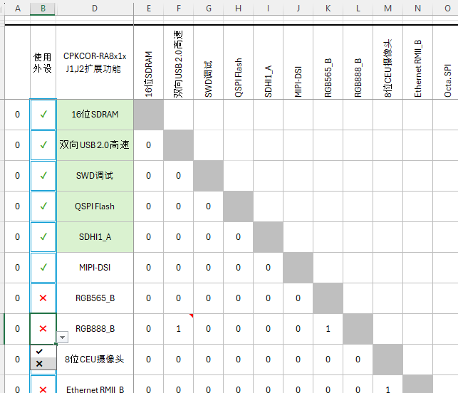
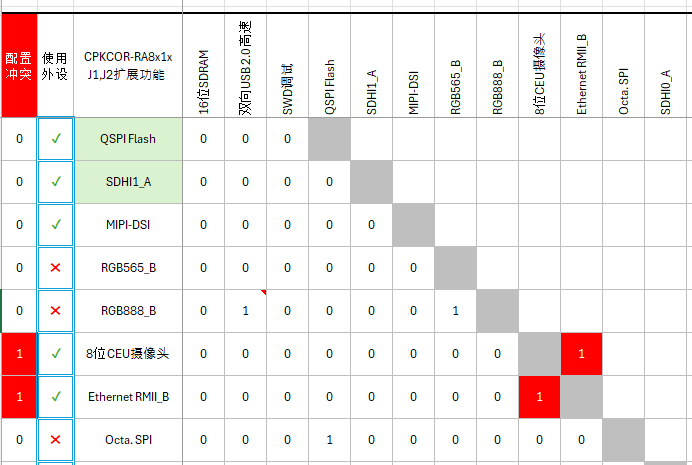
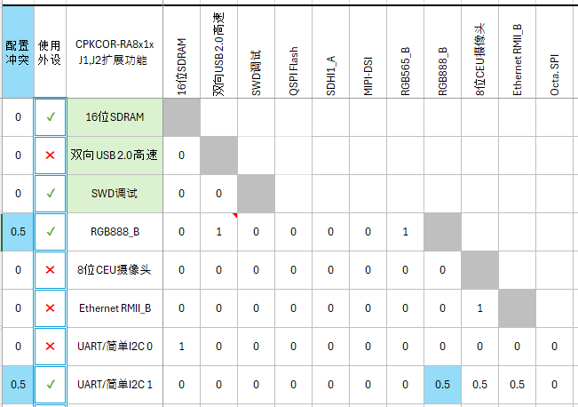
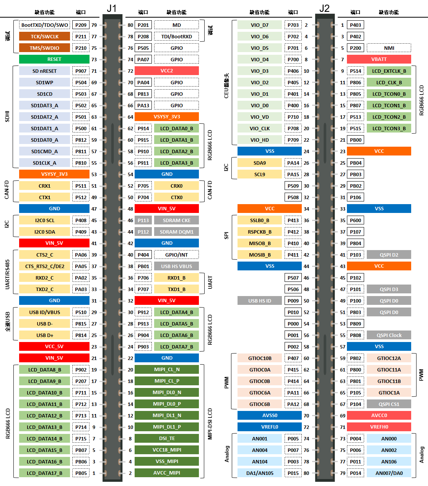

## 板对板扩展接口

板对板接口使用J1和J2两个80pin高密度高速接口，提供丰富的扩展功能。

### 电源和专用管脚

核心板可以通过J1、J2为扩展板提供多种电源，具体电源信号和位置见下图。

需要特别注意的几点
- VIN_5V的一般作用是由扩展板向核心板供5V电源，在实际应用中，必要时也可以用这个电源为扩展板提供5V电压（如CAN-FD收发器），核心板上的VIN_5V有2A限流，使用时请注意。
- VCC_5V是USB供电端通过二极管后的电源，没有限流，主要目的是为扩展板上的全速USB主机接口提供电源（USB FS主机需要设计电源开关和限流）。

核心板的设计上可以通过J1、J2实现部分外部电源输入，此时需要修改一些跳接电阻，具体内容请参考[CPKCOR-RA8D1B的电源设计](09_powerdesign.md)章节。

RA8D1B MCU带有MIPI-DSI接口，这部分管脚是专用的，分布在CPKCOR-RA8D1B的J1管脚上。其中DSI TE信号可以和GPIO服用，但一般的MIPI LCD屏驱动芯片都需要使用TE信号，所以在此作标注为专用管脚。

J1的44和46脚以灰色标注，这两个管脚在核心板上缺省是连接到SDRAM的（DQM1和CKE），放在扩展口上是为了提供SCI0的通信管脚。SCI0的所有可用管脚都与SDRAM管脚冲突，设计时选取了两个时序要求没那么严格的信号管脚，通过跳线电阻实现SCI0的UART功能（TXD0_A和RXD0_A）及I2C功能（SDA0_A和SCL0_A）。

R501和R502在核心板底面，由于不需要经常去安装/拆除这两个电阻，板上使用的是0402封装（1.0mm x 0.5mm）。

### 芯片外设功能扩展

CPKCOR-RA8D1B核心板上已经有SDRAM，USB 2.0 高速接口，MicroSD（TF）卡槽，QSPI NOR Flash。在这些功能以外，J1，J2上还可以扩展出RA8D1B MCU的其他功能，罗列如下：

- 显示输入/输出： MIPI-DSI，RGB565或RGB888 LCD输出, CEU摄像头接口
- 音频接口：I2S x2
- 存储：Octa-SPI （需要禁用核心板上的QSPI NOR Flash），SDHI0（MicroSD卡）
- 通信接口：RMII以太网接口，全速USB，I2C x2，I3C x1，SPI x2，多功能串口 x5（0~4,9）
- 定时器输入/输出接口：GPT，AGT，ULPT，RTC
- 模拟接口：高速比较器，ADC，DAC
- 调试接口：SWD，SWO跟踪调试接口，JTAG，4位TPIU跟踪调试接口（需配合核心板通孔扩展口实现并禁用SDRAM）

外设使用的MCU管脚有复用，使用时会有管脚冲突的情况。J1，J2可以支持的外设复用请使用[此Excel表格](CPKCOR-RA8D1B_Exp_Peripherals_chs_protected.xlsx)进行初步的配置。具体的管脚配置以FSP配置为准。

1. 在表格的B列选择您想使用的功能，绿色底色的功能是核心板上已经贴装器件的，缺省使用。如有必要，可以手动禁用某些核心板功能（如前面提到的SDRAM和UART0冲突，需要禁用SDRAM才能使用J1上的UART0管脚）
   
2. 如果有管脚冲突，那在A列会显示哪些功能冲突，您需要调整所选功能。
   1. 无法同时使用的功能，以红色表示，例如CEU摄像头和以太网不能同时使用
   
   2. 有些外设功能（如串口）有多组管脚可进行灵活配置，如其中某一组管脚与其他功能冲突时，会以蓝色显示，此时需要再FSP管脚配置中选择不冲突的管脚。如下图中，UART1的某组管脚和RGB888有冲突，但还有其他组的UART1管脚可用。
   
   3. 当外设的所有可用管脚位置都和其他外设冲突时，以红色显示。如下图中，UART1的所有可用管脚都冲突。（UART1共有两组管脚可用，其中一组和RGB888冲突，另一组和CEU冲突）
   

3. 一个较为特殊的管脚需要留意（Excel文件中有注释）
   USB 2.0 HS的VBUS（RA8作为USB设备时，用于检测USB是否插入）引脚在核心板上缺省是PB01端口，PB01也是RGB888 LCD接口上的D18，以及多功能串口上的控制管脚，如果同时使用USBHS_VBUS和其他一个功能，则需要修改核心板上的跳线电阻R402/R403，详见[RA8 USB 2.0 高速接口](07_usbhs.md)章节。

灵活的功能组合可以实现各种评估所需的配置，配置确定后，即可快速设计一个扩展板，满足实际评估甚至是原型系统的需求。

瑞萨设计了一个样例配置，使用的功能定义如下。

核心板使用的是两个HRS [DF40C-80DP-0.4V(51)](https://item.szlcsc.com/279578.html) 80脚接插件，在设计扩展板时，对应的接插件有多种合高可以选用，1.5/2.0/3.0/3.5/4.0mm，例如:

- 1.5mm合高的型号[DF40C-80DS-0.4V(51)](https://item.szlcsc.com/295540.html)
- 4.0mm合高的型号[DF40HC(4.0)-80DS-0.4V(51)](https://item.szlcsc.com/5973570.html)

注意：核心板背面有MicroSD（TF）卡插槽，卡槽的高度是2.0mm，在设计扩展底板时，请注意核心板投影范围内的器件限高。如果您使用合高1.5mm的接插件，在扩展底板上需要将TF卡槽对应的部分挖空。

J1，J2接插件，TF卡槽以及安装孔的位置信息请查看[此设计文件](CPKCOR-RA8x1x_V2_MEC_20240312.dxf)。

接插件管脚电流限制为300mA，在设计扩展底板时请注意电源管脚的供电能力。如果底板需要较大的工作电流，建议底板上有单独的电源，此时，核心板也可以由底板供电，详见[CPKCOR-RA8D1B的电源设计](09_powerdesign.md)章节。

[返回目录](01_overview.md)             [下一篇：RA8的调试和烧录接口](06_debug.md)
