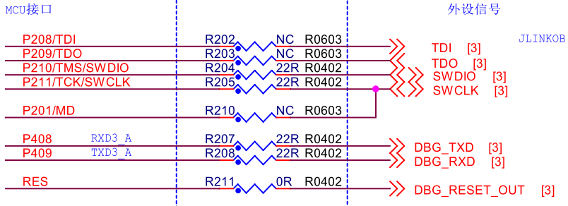
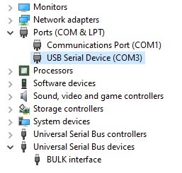
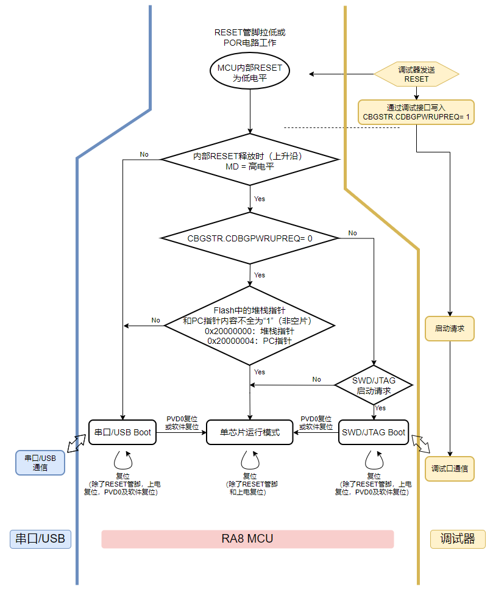
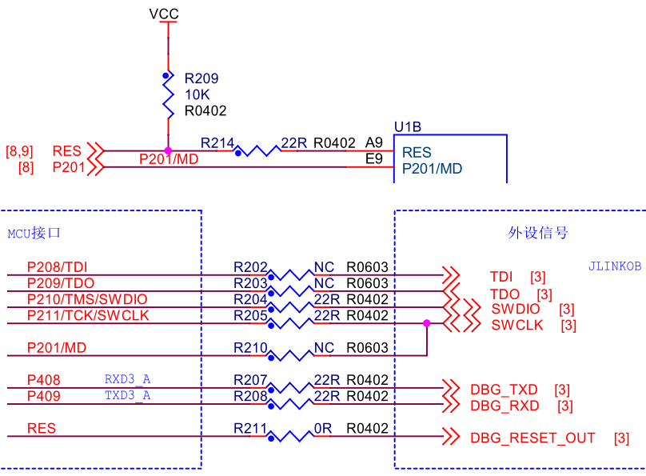

## RA8的调试和烧录接口

### RA8 MCU支持的调试和烧录接口

RA8 MCU 支持以下调试接口：SWD，JTAG，跟踪调试接口（SWO单线和TPIU四线），除了调试软件，还可以通过调试接口实现MCU片内Flash的烧录，以及外部Flash烧录（例如J-Flash配合JLink使用）。

除了使用调试器进行Flash烧录，RA8 MCU本身也支持Boot模式，进入Boot模式后，RA8 MCU内置的工厂Boot程序会和上位机通信，实现Flash烧录和其他功能（如产品生命周期管理，Trustzone边界设定等）。有关工程Boot程序的详情，请参考[RA8D1工厂Boot程序应用笔记](https://www.renesas.cn/cn/zh/document/apn/renesas-boot-firmware-ra8d1-mcu-group)。

RA8 MCU支持的Boot模式主要有以下几种: 串口Boot（通过UART9的P209/P208端口），USB Boot（通过USB FS接口），SWD/JTAG Boot。其中串口Boot和USB Boot不需要额外的硬件工具，SWD/JTAG则需要对应的调试器或烧录器配合使用。

可以看到，通过SWD或JTAG接口，可以实现调试和Boot模式两种功能，我们首选SWD作为调试和烧录接口。

### 核心板上的板载调试器

CPKCOR-RA8D1B板载了JLink调试器，运行JLink固件的是瑞萨的RA4M2 MCU，全速USB接口。

基于RA4M2的板载JLink调试器可以支持以下通用功能：
- SWD调试， JTAG调试， 
- SWO跟踪
- USB转UART，可选硬件流控功能
JLink调试器还针对瑞萨的RA4/6/8 MCU特别提供Boot模式支持，包括：
- 带MD控制功能的串口Boot（复用JTAG管脚）
- SWD Boot（SWD配合RESET时序）

### RA8 MCU的调试功能

在核心板上，RA8 MCU调试时仅使用SWD接口，并没有使用SWO功能。RA8 MCU的SWD接口所使用的端口P211和P210，在MCU复位后，会自动被设置为SWDCLK和SWDIO，具体见RA8D1用户手册19.2.5-管脚功能选择寄存器的注释1。两个管脚缺省都设置成有片内上拉，在JLink MCU部分就没有加上拉电阻。

在实际应用中，如果已经完成了系统调试，SWD接口所在的管脚可能被设置为GPIO或其他功能（尤其在I/O资源较为紧张的少管脚封装上），此时如果只连接SWDCLK和SWDIO进行调试，就可能会无法正常通信。在系统设计时请一定要将RESET信号也连上，这样调试器就可以控制RA8 MCU的复位，并在复位后连接SWD接口。

RA8 MCU和JLink调试器的连接如下图所示：

- SWD接口通过R204和R205缺省连接，RESET信号通过R211连接。
- JLink提供的一路USB转UART通过R207和R208连接到RA8 MCU的串口3。

通过USB-C线连接JDBG接口后，JDBG口开始为核心板供电。以Windows系统为例，新版JLink已经使用WinUSB驱动，无需安装JLink的驱动程序也能识别到设备，橙色LED灯会闪几下后变成常亮。系统里会有两个新的设备，一个USB BULK接口，一个USB转串口。

成功识别到JLink后即可开始调试操作。

### 使用外接调试器

外接调试器时需要禁用核心板上的JLink，基本注意事项在[CPKCOR-RA8D1B 通孔扩展接口](04_th_expansion.md)章节中已有说明。

如果需要使用RA8 MCU的跟踪调试接口（TPIU），可以在核心板上通过**禁用SDRAM**后，配合外部调试器（如JTrace）来实现。

| 通孔接口 | GPIO | 调试功能  |
| :------: | :--: | :-------: |
|  J902-1  |      |    VSS    |
|  J902-2  | P210 | **SWDIO** |
|  J902-3  | P211 | **SWCLK** |
|  J902-4  |      |    VCC    |
|  JD-10   |      |   RESET   |
|   JA-7   | P308 |   TCLK    |
|   JA-8   | P307 |  TDATA0   |
|   JA-9   | P306 |  TDATA1   |
|  JA-10   | P305 |  TDATA2   |
|  JA-11   | P304 |  TDATA3   |

### RA8 MCU的Flash烧录接口

MCU Flash的烧录可以通过多种方式来实现，本质上是通过控制RA8 MCU的Flash控制寄存器来实现数据的写入，控制方式可以是：
- 通过调试功能直接控制寄存器 - 速度慢
- 通过调试功能将Flash烧录算法写入RAM后执行 - 大部分烧录器使用此方式，速度快，功能灵活。
- 通过RA MCU自带的工厂Boot程序和上位机通信并烧写Flash - 串口和USB boot无需额外硬件，SWD/JTAG Boot还是需要外部硬件

RA8 MCU的一些设定功能无法通过调试功能实现（即无法通过用户程序实现），如Trustzone边界设定，MCU生命周期管理，安全密钥安装等，这些功能仅能通过Boot模式，由上位机发命令，通过工厂Boot程序实现。

综上所述，使用SWD接口，可以同时实现调试功能和Boot功能。

RA8 MCU和其他RA6/RA4 MCU一样，都有MD管脚，用来控制芯片是否进入Boot模式。但SWD/JTAG Boot是RA8上新添加的功能，所以MD管脚的控制逻辑和其他系列MCU不同。判断RA8 MCU进入哪种工作模式请参考硬件手册3.4章节 - “工作模式切换”，简单整理为下图。

可见MD管脚为低电平时，RA8和RA4/6 MCU一样，会进入串口/USB Boot模式。但MD管脚为高电平时，调试器可以在RESET为低时写入控制寄存器，从而实现SWD/JTAG Boot。

在COKCOR-RA8D1B核心板上，缺省使用SWD Boot。MD管脚所在的P201端口在复位时会自动设置上拉有效（见RA8D1用户手册19.2.5-管脚功能选择寄存器的注释1），无需外接上拉电阻。SWD Boot需要调试器可以控制RA8的RESET，所以RESET信号通过R211缺省连接到JLink。

板载的JLink也支持RA8的串口Boot。如果要使用串口Boot，请连接上图中的R202,R203和R210，这三个电阻在PCB底面靠近JA的地方，使用0603封装（1.6mm x 0.8mm）。JLink会自动控制RESET和MD信号，进入串口Boot模式。

核心板上并没有USB FS端口，如果要使用USB Boot，需要外接扩展板。除了USB信号以外，还需要控制MD信号，使RA8 MCU进入USB Boot模式。

瑞萨提供Renesas Flash Programmer软件配合MCU的Boot模式，实现Flash烧录和其他MCU设置功能，详见[RFP网页](https://www.renesas.cn/cn/zh/software-tool/renesas-flash-programmer-programming-gui)。

[返回目录](01_overview.md)             [下一篇：RA8 USB 2.0 高速接口](07_usbhs.md)
