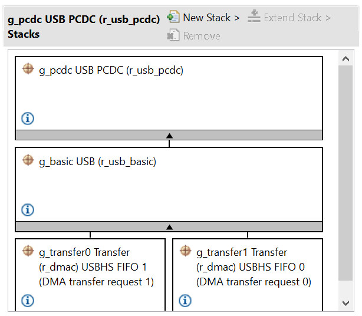
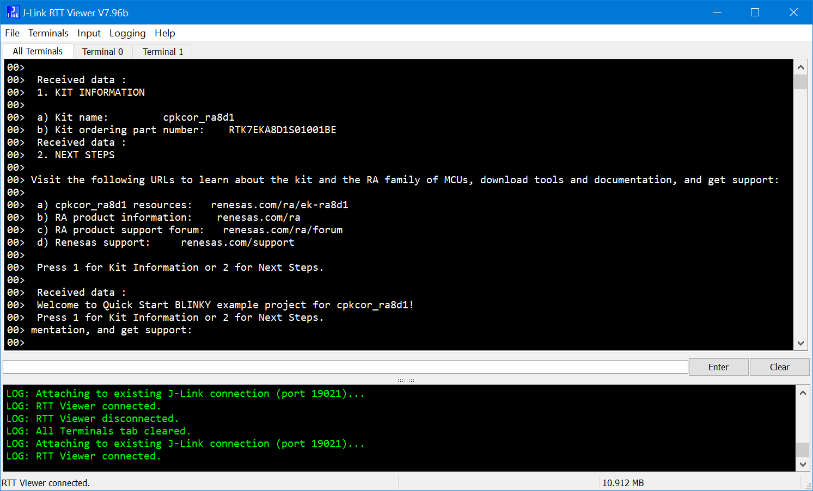

## 1.参考例程概述
该示例项目演示了基于瑞萨 FSP 的瑞萨 RA MCU  USB HCDC的基本功能，注意本例程基于FreeRTOS，需在USB口上连接一个烧录了PCDC USB EP的代码验证。当代码运行时，RA8D1的USB口可以识别到连接在USB端口上的一个PCDC设备。
代码流程说明如下，Host向Device发送一个‘1’字符，Device会返回当前的硬件信息，接下来Host向Device发送一个‘2’字符，Device会返回一些链接，展示RA系列产品的官网链接和论坛Rulz地址。

### 1.1 创建新工程，BSP选择“CPK-RA8D1B Core Board”，RTOS选择FreeRTOS。
### 1.2 Stack中添加“USB HCDC (r_usb_hcdc)”，详细的属性设置请参考例程

### 1.3 将usb_pcdc_cpkcor_ra8d1b_ep中的Image文件烧写到一块cpkcor_ra8d1上。
### 1.4 利用一根USB线（A to C）将PC和板上的JDBG连接起来。利用另外一根USB线（C to C）将JUSB和另外一块cpkcor_ra8d1的JUSB连接起来。
### 1.5 在e2 studio中调试代码，代码自由运行。PC端打开J-Link RTT Viewer，会显示如下Log打印：

### 1.6 代码继续运行，则会打印如下Log：

本示例代码中，Host循环向Device发送‘1’和‘2’，Device依据收到的数据，打印不同的Log。若收到‘1’，则打印硬件信息。若收到‘2’，则打印帮助信息。更多细节，请参考代码中的内容。

## 2. 支持的电路板：
CPKCOR-RA8D1B

## 3. 硬件要求：
1块瑞萨 RA核心板：CPKCOR-RA8D1B

2根Type-C USB 数据线，一根用于连接JDBG和PC，另一根用于连接JUSB和PC。

## 4. 硬件连接：
通过Type-C USB 电缆将 CPKCOR-RA8D1B板上的 USB 调试端口（JDBG）连接到主机 PC。通过Type-C to Type-C线连接作为Host的cpkcor_ra8d1 JUSB和作为Device的cpkcor_ra8d1 JUSB。